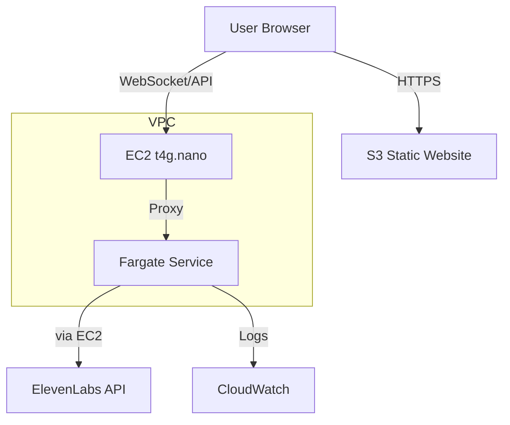

# Deployment Architecture

## Overview

This document describes the cost-optimized AWS deployment architecture for the ElevenLabs MCP Server with Frontend. The architecture is designed to be secure, reliable, and cost-effective, leveraging AWS Fargate's scheduling capabilities and CloudFront for static content delivery.

## Components

### 1. Frontend Hosting
- **S3 Static Website**
  - **Configuration:**
    - Website hosting enabled
    - SSL via ACM/Let's Encrypt
    - Custom domain
  - **Estimated Cost:** <$0.1/month (minimal traffic)

### 2. AWS Fargate Service (Backend)
- **Configuration:**
  - Resource allocation: 0.5 vCPU, 1GB RAM (increased for WebSocket handling)
  - Scheduled scaling:
    - Active hours: 08:00-20:00 (configurable)
    - Scale to zero outside active hours
  - WebSocket support enabled
  - Auto-scaling based on connection count
- **Estimated Cost:** ~$8-10/month with 12h/day runtime

### 3. EC2 Instance (Proxy & NAT)
- **Instance Type:** t4g.nano (ARM)
- **Purpose:** 
  - Reverse proxy for WebSocket/API
  - NAT for Fargate outbound traffic
- **Software:**
  - Nginx with WebSocket support
  - NAT configuration
  - SSL termination
- **Configuration:**
  - Auto-start/stop aligned with Fargate schedule
  - Basic monitoring
  - Spot instance possible
  - Health checks
- **Estimated Cost:** ~$3/month with 12h/day runtime

### 4. VPC Configuration
- **Structure:**
  - 1 private subnet (Fargate)
  - 1 public subnet (EC2)
  - Minimal security groups
- **Cost:** Free

### 5. Container Registry (ECR)
- **Usage:** Store Docker images (Frontend & Backend)
- **Lifecycle Policy:** Keep last 5 images
- **Estimated Cost:** <$1/month

### 6. CloudWatch
- **Configuration:**
  - Basic logging
  - Essential metrics only
  - WebSocket connection metrics
  - 7-day log retention
- **Estimated Cost:** ~$2/month

## Security

### Authentication
- API Key based authentication
- WebSocket connection validation
- CloudFront signed URLs (optional)
- WAF protection (optional)

### Network Security
- Private subnet for Fargate tasks
- EC2 instance in public subnet
- SSL/TLS encryption
- Security group rules for WebSocket ports

## Cost Optimization

### Total Estimated Costs (100 calls/day, 9h/day)
| Component           | Monthly Cost (9h/day) | Notes |
|--------------------|----------------------|-----------------|
| S3 Website         | <$0.1               | Minimal traffic |
| Fargate            | $6-8                | Could use 0.25 vCPU |
| EC2 t4g.nano       | $2                  | Within CPU credits |
| ECR                | <$1                 | Fixed |
| CloudWatch         | ~$1                 | Minimal logs |
| **Total**          | **~$9-12/month**   | |

### Usage Assumptions
- Operating hours: 09:00-18:00 (9h/day)
- API calls: ~100/day (~11/hour)
- WebSocket connections: 1-2 concurrent
- Data transfer: <1GB/month
- Frontend users: Single digit daily

### Cost Saving Strategies
1. **Scheduled Operation**
   - Run only during active hours
   - Automatic shutdown/startup of EC2 and Fargate
   - Potential savings: 50%+ compared to 24/7

2. **Resource Optimization**
   - Optimized Fargate task size
   - t4g.nano ARM instance
   - CloudFront caching optimization
   - Spot instance for EC2 (optional)

3. **Monitoring & Logs**
   - Minimal retention period
   - Basic monitoring only
   - Selective metric collection

## Scaling Considerations

### Frontend Scaling
- CloudFront handles global distribution
- S3 scales automatically
- Static assets cached at edge

### Backend Scaling
- Vertical scaling:
  - CPU: 0.5 vCPU to 4 vCPU
  - Memory: 1GB to 30GB
- Horizontal scaling:
  - Based on WebSocket connection count
  - Single AZ deployment to reduce costs

## Maintenance

### Updates
- Frontend deployments via CI/CD to S3
- Backend container updates via CI/CD
- EC2 instance updates during off-hours
- Security patches automated
- Nginx configuration management via user-data

### Monitoring
- WebSocket connection metrics
- Frontend performance metrics
- Error rate monitoring
- Cost alerts
- EC2 instance health

## Future Optimizations
1. Implement WebSocket connection pooling
2. Add WAF protection
3. Implement more sophisticated scaling policies
4. Add performance monitoring dashboard
5. Consider multi-AZ deployment if needed 