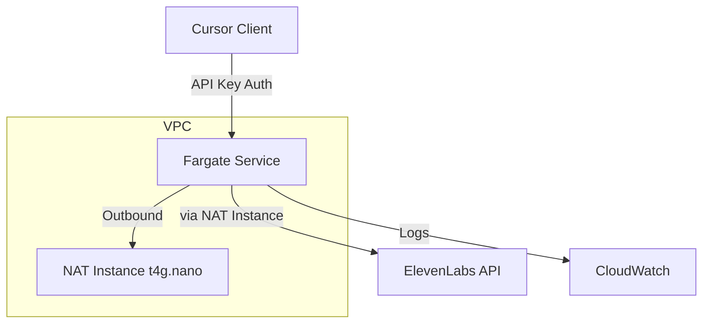

# Deployment Architecture

## Overview

This document describes the cost-optimized AWS deployment architecture for the ElevenLabs MCP Server. The architecture is designed to be secure, reliable, and cost-effective, leveraging AWS Fargate's scheduling capabilities and minimal required infrastructure.

## Components

### 1. AWS Fargate Service
- **Configuration:**
  - Minimal resource allocation: 0.25 vCPU, 0.5GB RAM
  - Scheduled scaling:
    - Active hours: 08:00-20:00 (configurable)
    - Scale to zero outside active hours
  - Auto-scaling based on CPU utilization (optional)
- **Estimated Cost:** ~$4-5/month with 12h/day runtime

### 2. NAT Instance
- **Instance Type:** t4g.nano
- **Purpose:** Enable outbound communication to ElevenLabs API
- **Configuration:**
  - Auto-start/stop aligned with Fargate schedule
  - Basic monitoring
  - Spot instance possible for additional savings
- **Estimated Cost:** ~$2/month with 12h/day runtime

### 3. VPC Configuration
- **Structure:**
  - 1 private subnet (Fargate)
  - 1 public subnet (NAT Instance)
  - Minimal security groups
- **Cost:** Free

### 4. Container Registry (ECR)
- **Usage:** Store Docker images
- **Lifecycle Policy:** Keep last 5 images
- **Estimated Cost:** <$1/month

### 5. CloudWatch
- **Configuration:**
  - Basic logging
  - Essential metrics only
  - 7-day log retention
- **Estimated Cost:** ~$1/month

## Security

### Authentication
- API Key based authentication
- Environment variable: `MCP_SERVER_API_KEY`
- IP whitelisting (optional)

### Network Security
- Private subnet for Fargate tasks
- Minimal security group rules
- No direct internet access from Fargate

## Cost Optimization

### Total Estimated Costs
| Component    | Monthly Cost (12h/day) |
|-------------|----------------------|
| Fargate     | $4-5                |
| NAT Instance| $2                  |
| ECR         | <$1                 |
| CloudWatch  | ~$1                 |
| **Total**   | **~$8-9/month**    |

### Cost Saving Strategies
1. **Scheduled Operation**
   - Run only during active hours
   - Automatic shutdown/startup
   - Potential savings: 50%+ compared to 24/7

2. **Resource Optimization**
   - Minimal Fargate task size
   - t4g.nano for NAT (ARM-based)
   - Spot instances for NAT (optional)

3. **Monitoring & Logs**
   - Minimal retention period
   - Basic monitoring only
   - Selective metric collection

## Scaling Considerations

### Vertical Scaling
- Fargate task size can be adjusted:
  - CPU: 0.25 vCPU to 4 vCPU
  - Memory: 0.5GB to 30GB
- No downtime during scaling

### Horizontal Scaling
- Not implemented in initial setup
- Can be added if needed:
  - Auto-scaling based on CPU/Memory
  - Multiple tasks across AZs

## Maintenance

### Updates
- Container image updates via CI/CD
- NAT Instance updates during off-hours
- Security patches automated

### Monitoring
- Basic CloudWatch metrics
- Error rate monitoring
- Cost alerts (optional)

## Future Optimizations
1. Implement Spot instances for NAT
2. Add cross-AZ redundancy (if needed)
3. Implement more sophisticated scaling policies
4. Add performance monitoring 