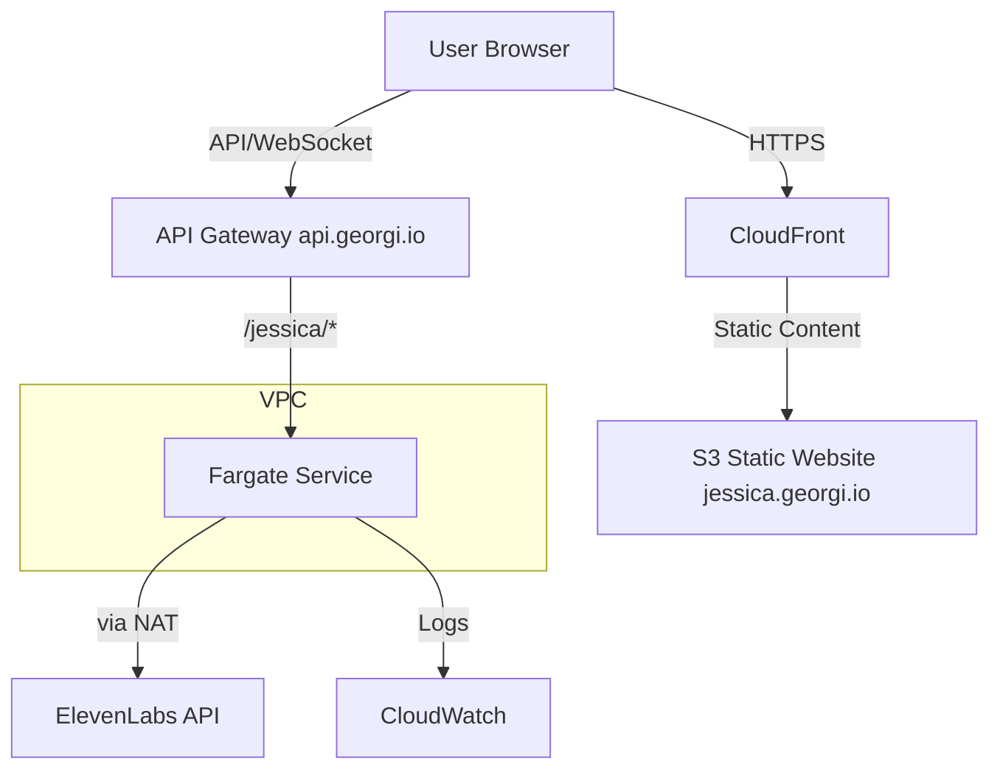

# Deployment Architecture

## Overview

This document describes the cost-optimized AWS deployment architecture for Project Jessica (ElevenLabs TTS MCP), integrated into a central API Gateway infrastructure. The architecture is designed to be secure, reliable, and cost-effective, leveraging AWS Fargate's scheduling capabilities and CloudFront for static content delivery.



## Repository Structure

The deployment is split across two repositories for better separation of concerns:

### 1. Service Repository (jessica)
```
jessica/
├── src/                    # Application code
├── terraform/
│   ├── local/             # Local development setup
│   │   └── main.tf        # Local setup without API GW
│   └── modules/
│       └── service/       # Reusable service module
│           ├── main.tf    # Service definition (Fargate, etc.)
│           ├── variables.tf
│           └── outputs.tf
└── infrastructure/
    └── api-gw-integration.tf  # API GW integration module
```

### 2. Infrastructure Repository (georgi-io-infrastructure)
```
georgi-io-infrastructure/
├── terraform/
│   ├── global/
│   │   ├── route53/      # DNS configuration
│   │   └── acm/         # SSL certificates
│   ├── api-gateway/     # Central API Gateway
│   └── services/
│       └── jessica/
│           └── main.tf  # Imports service module
```

## Components

### 1. API Gateway (api.georgi.io)
- **Configuration:**
  - HTTP API type for cost optimization
  - Custom domain with SSL
  - Route configuration for services
  - WebSocket support
- **Routes:**
  - `/jessica/*` → Jessica TTS API
  - `/jessica/ws` → WebSocket connections
- **Estimated Cost:** ~$1-2/month for moderate usage

### 2. Frontend Hosting
- **CloudFront + S3 Static Website (jessica.georgi.io)**
  - **Configuration:**
    - Website hosting enabled
    - SSL via ACM
    - Custom domain
  - **Estimated Cost:** <$0.1/month (minimal traffic)

### 3. AWS Fargate Service (Backend)
- **Configuration:**
  - Resource allocation: 0.5 vCPU, 1GB RAM
  - Scheduled scaling:
    - Active hours: 08:00-20:00 (configurable)
    - Scale to zero outside active hours
  - WebSocket support enabled
  - Auto-scaling based on connection count
- **Estimated Cost:** ~$8-10/month with 12h/day runtime

### 4. VPC Configuration
- **Structure:**
  - Private subnets for Fargate
  - NAT Gateway for outbound traffic
- **Cost:** ~$30/month (NAT Gateway)

### 5. Container Registry (ECR)
- **Usage:** Store Docker images
- **Lifecycle Policy:** Keep last 5 images
- **Estimated Cost:** <$1/month

### 6. CloudWatch
- **Configuration:**
  - Basic logging
  - Essential metrics only
  - WebSocket connection metrics
  - 7-day log retention
- **Estimated Cost:** ~$2/month

## Security

### Authentication & Authorization
- API Gateway authentication
- WebSocket connection validation
- Service-to-service authentication
- WAF protection (optional)

### Network Security
- Private subnets for Fargate tasks
- SSL/TLS encryption throughout
- Security group rules for service access

## Cost Optimization

### Total Estimated Costs (100 calls/day, 9h/day)
| Component           | Monthly Cost (9h/day) | Notes |
|--------------------|----------------------|-----------------|
| API Gateway        | $1-2                | Includes data transfer |
| S3 + CloudFront    | <$0.1               | Minimal traffic |
| Fargate            | $6-8                | Could use 0.25 vCPU |
| NAT Gateway        | $30                 | Fixed cost |
| ECR                | <$1                 | Fixed |
| CloudWatch         | ~$1                 | Minimal logs |
| **Total**          | **~$40/month**     | |

### Usage Assumptions
- Operating hours: 09:00-18:00 (9h/day)
- API calls: ~100/day (~11/hour)
- WebSocket connections: 1-2 concurrent
- Data transfer: <1GB/month
- Frontend users: Single digit daily

### Cost Saving Strategies
1. **Scheduled Operation**
   - Run only during active hours
   - Automatic shutdown/startup
   - Potential savings: 50%+ compared to 24/7

2. **Resource Optimization**
   - Optimized Fargate task size
   - CloudFront caching optimization
   - Consider sharing NAT Gateway with other services

## Deployment Workflow

### Initial Setup
1. **Infrastructure Repository:**
   ```bash
   cd georgi-io-infrastructure
   terraform init
   terraform apply -target=module.api_gateway
   ```

2. **Service Deployment:**
   ```bash
   cd terraform/services/jessica
   terraform init
   terraform apply
   ```

### Local Development
1. **Service Testing:**
   ```bash
   cd jessica/terraform/local
   terraform init
   terraform apply
   ```

### CI/CD Integration
1. **Service Repository Pipeline:**
   - Build and test service
   - Push container image
   - Test Terraform modules
   - Tag releases

2. **Infrastructure Repository Pipeline:**
   - Pull service modules
   - Deploy to staging/production
   - Manage central resources

## Maintenance

### Updates
- Frontend deployments via CI/CD to S3
- Backend container updates via CI/CD
- Infrastructure updates through Terraform
- Security patches automated

### Monitoring
- API Gateway metrics
- WebSocket connection metrics
- Frontend performance metrics
- Cost alerts
- Service health checks

## Future Optimizations
1. Implement WebSocket connection pooling
2. Add WAF protection
3. Implement more sophisticated scaling policies
4. Add performance monitoring dashboard
5. Consider sharing NAT Gateway costs with other services 