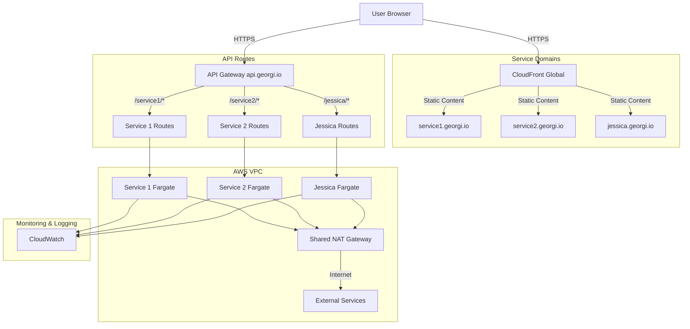

# Global Deployment Architecture - georgi.io

## Overview

This document describes the global AWS infrastructure architecture for georgi.io services. The architecture is designed to be scalable, secure, and cost-effective, providing a central infrastructure for multiple services while maintaining service isolation and independent deployment capabilities.



## Repository Structure

The infrastructure is managed across multiple repositories, following a clear separation of concerns:

### 1. Global Infrastructure Repository
```
georgi-io-infrastructure/
├── docs/
│   ├── global-deployment-architecture.md   # This document
│   └── service-architectures/
│       └── jessica.md                      # Service-specific architecture
├── terraform/
│   ├── global/                            # Global AWS resources
│   │   ├── dns/                           # Route53 configuration
│   │   ├── networking/                    # VPC, NAT Gateway, etc.
│   │   ├── monitoring/                    # CloudWatch, alerts
│   │   └── security/                      # IAM, WAF, etc.
│   ├── api-gateway/                       # Central API Gateway
│   │   ├── main.tf
│   │   └── routes/                        # Service route configurations
│   └── services/                          # Service-specific resources
│       └── jessica/                       # Jessica (ElevenLabs TTS)
└── .github/
    └── workflows/                         # Global CI/CD pipelines
```

### 2. Service Repositories
```
service-name/                              # e.g., jessica/
├── src/                                  # Service source code
├── terraform/
│   ├── local/                           # Local development setup
│   └── modules/                         # Service infrastructure modules
└── infrastructure/
    └── api-gw-integration.tf            # API Gateway integration
```

## Global Components

### 1. DNS & Domains (Route53)
- **Primary Domain**: georgi.io
- **Service Subdomains**: *.georgi.io
- **API Domain**: api.georgi.io
- **Estimated Cost**: $0.50/hosted zone/month + $0.40/million queries

### 2. Central API Gateway
- **Domain**: api.georgi.io
- **Features**:
  - HTTP API type
  - Custom domain with SSL
  - Service route isolation
  - WebSocket support
- **Cost**: Base charge + per-request pricing
  - ~$1-2/month/service for moderate usage

### 3. Shared VPC Infrastructure
- **Network Layout**:
  - Multiple Availability Zones
  - Public & Private Subnets
  - Shared NAT Gateway
- **Cost Distribution**:
  - NAT Gateway: $30/month (shared across services)
  - VPC Endpoints: ~$7/month (optional)

### 4. Security
- **SSL/TLS**:
  - ACM certificates for *.georgi.io
  - Automatic renewal
- **WAF** (Optional):
  - Rate limiting
  - IP filtering
  - Attack protection
- **IAM**:
  - Service-specific roles
  - Least privilege principle

### 5. Monitoring & Logging
- **CloudWatch**:
  - Centralized logging
  - Custom dashboards
  - Service-specific metrics
- **Alerts**:
  - Cost thresholds
  - Error rates
  - Performance metrics

## Service Integration

### Adding a New Service

1. **Infrastructure Updates**:
```hcl
# terraform/api-gateway/routes/new-service.tf
module "new_service_routes" {
  source = "../modules/api-routes"
  
  service_name = "new-service"
  base_path    = "/new-service"
}
```

2. **Service Repository Setup**:
```hcl
# new-service/infrastructure/api-gw-integration.tf
module "api_integration" {
  source = "git::https://github.com/georgi-io/infrastructure-modules.git//api-gw"
  
  service_name = "new-service"
}
```

### Current Services

1. **Jessica (ElevenLabs TTS)**
   - Repository: jessica/
   - Frontend: jessica.georgi.io
   - API: api.georgi.io/jessica/*
   - WebSocket: api.georgi.io/jessica/ws

## Cost Management

### Shared Resources (Monthly)
| Component        | Base Cost | Per Service | Notes |
|-----------------|-----------|-------------|--------|
| NAT Gateway     | $30       | $30 ÷ n     | n = number of services |
| API Gateway     | $1-2      | Direct      | Per service usage |
| DNS             | $0.50     | $0.50       | Per subdomain |
| CloudWatch      | $2-5      | Usage based | Log retention configurable |

### Service-Specific Costs (Example: Jessica)
| Component        | Cost      | Notes |
|-----------------|-----------|--------|
| Fargate         | $6-8      | 9h/day usage |
| S3 + CloudFront | <$0.1     | Static hosting |
| NAT (shared)    | $30 ÷ n   | n = number of services |

## Deployment Workflow

### Global Infrastructure
```bash
# Initialize and apply global resources
cd georgi-io-infrastructure/terraform/global
terraform init && terraform apply

# Setup API Gateway
cd ../api-gateway
terraform init && terraform apply
```

### Service Deployment
```bash
# Deploy service-specific resources
cd georgi-io-infrastructure/terraform/services/[service-name]
terraform init && terraform apply
```

## Maintenance & Operations

### Regular Tasks
1. **SSL Certificate Renewal**:
   - Automated through ACM
   - Monitor expiration dates

2. **Cost Review**:
   - Monthly cost analysis
   - Resource optimization
   - Usage patterns review

3. **Security Updates**:
   - WAF rule updates
   - IAM policy review
   - Security patch application

### Monitoring
1. **Service Health**:
   - API Gateway metrics
   - Service-specific health checks
   - Error rate monitoring

2. **Cost Control**:
   - Budget alerts
   - Resource utilization
   - Scaling metrics

## Future Considerations

1. **Multi-Region Support**:
   - Global API Gateway
   - Regional service deployment
   - CloudFront for global static content

2. **Enhanced Security**:
   - WAF implementation
   - Enhanced monitoring
   - Security automation

3. **Cost Optimization**:
   - Reserved capacity
   - Automatic scaling
   - Resource sharing

4. **Service Mesh**:
   - Service discovery
   - Inter-service communication
   - Traffic management 